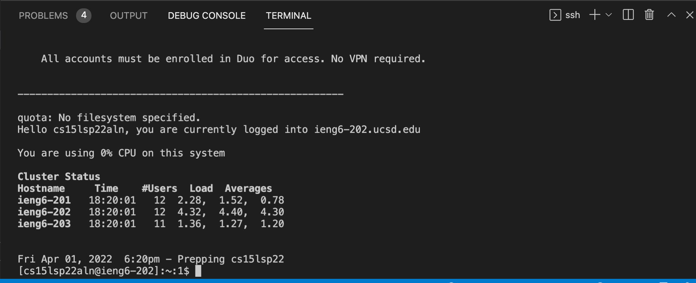
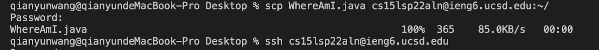

# Lab report 1
* Installing VScode
> Since I already have VScode installed on my computer, I have VScode ready to work. If you have not installed, you can go to this [link](https://code.visualstudio.com) to download it on your computer.

* Remotely Connecting
> You should look up course-specific account at this [link](https://sdacs.ucsd.edu/~icc/index.php). I opened a terminal in VScode, typed in <mark>ssh cs15lsp22aln@ieng6.ucsd.edu</mark>(course-specific account), and pressed enter. After typing in the password, the local computer was remotely connected to the remote computer.
  

* Trying Some Commands
> **cd ~** : takes back to the home directory.  
**ls -lat** : lists the long-format of all the files, including the hidden files, with the permissions and sorts them by most recently accessed.  
**ls -a** : lists all the files, including the hidden files.  
**ls < directory >** : lists the files in the directory.  
**ls -l** : lists the files in long format.   
**ls -a** : list all the files.  
**ls -t** : sorts the files by most recently accessed.

* Moving Files with <mark>scp</mark>
> We want to copy a file from local computer to the remote computer using the command scp. I created a file on the computer called Whereami.java, then ran this command in the terminal <mark>scp WhereAmI.java cs15lsp22aln@ieng6.ucsd.edu:~/</mark> (course-specific account). After entering the password, the file was successfully copied in the remote computer!

* Setting an SSH key
> We want to avoid typing ssh password everytime we log in or run scp. The solution is setting up ssh key. First, on my local computer, I typed the command <mark>ssh-keygen</mark>. Then it will ask me to enter the file to save the key. I typed the file the command suggested. And I did not enter the paraphrase to set up an empty ssh key. I logged into the remote computer, typed in the command <mark>mkdir .ssh</mark>. Then I logged out and typed in the command on the local computer <mark>scp /Users/qianyunwang/.ssh/id_rsa.pub cs15lsp22aln@ieng6.ucsd.edu:~/.ssh/authorized_keys</mark>. In the end everything should work!

* Optimizing Remote Running
> Ssh key saves time when I log in, make local edit in files and copying them into the remote computer.  

