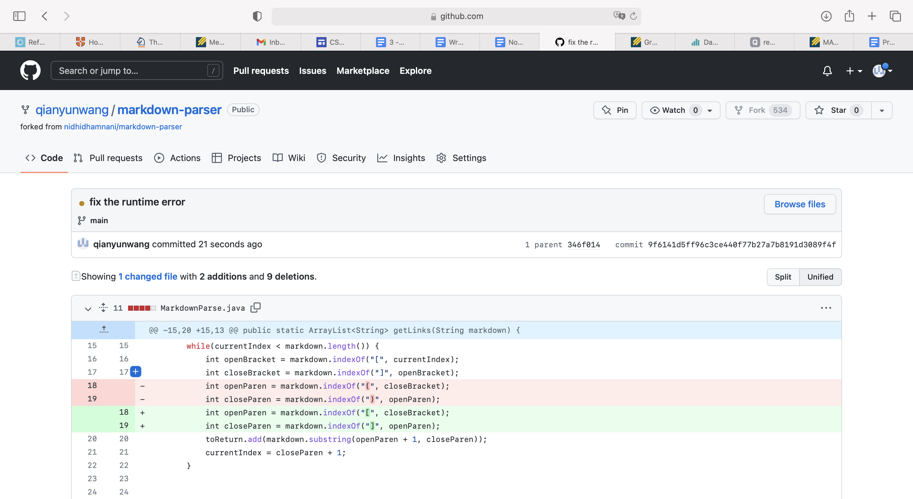
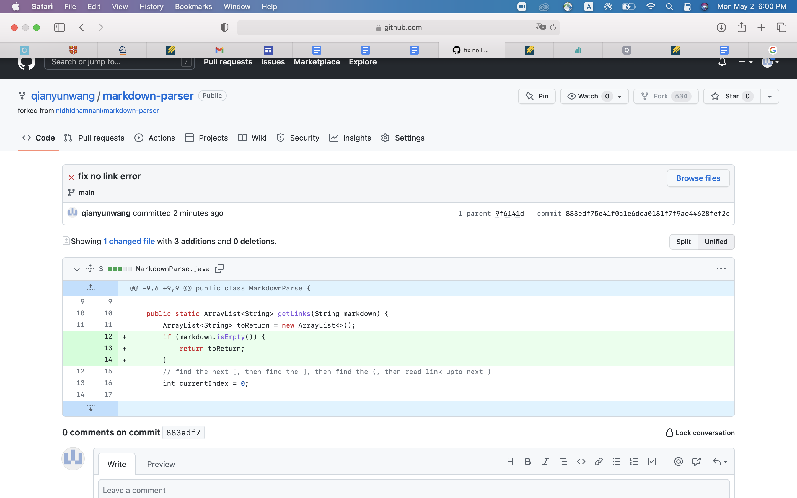

# Lab report 2
* logical error with image reference
>   
The [file](another-file.md) outputs two image links `[image1.png, image2.png]`. This is an logical error as I'm looking for an output of two regular links. The failure-inducing inputs are the image references. The bug is the missing code in MarkdownParse.java that did not cope with image references. The symptom is the logical error that outputs two image references instead of a blank list `[]`. 

* runtime error when using `[]` but not `()`
>   
The [file](another-file2.md) outputs an index out of bound exception `Exception in thread "main" java.lang.StringIndexOutOfBoundsException: begin 0, end -1, length 90`. The failure-inducing inputs are `[]` that are used to hold the links. The bug is the code in markdownParse.java that did not deal with the link container. The symptom is the runtime error which is an index out of bound exception that is caused by the failure-inducing inputs.

* logical error with no link
>   
The [file](another-file3.md) outputs `[]`. The failure-inducing input is the blank file with no link. The bug is that there is no lines of code in MarkdownParse.java to check a blank file. The symptom is the logical error caused by the failure-inducing inputs.

