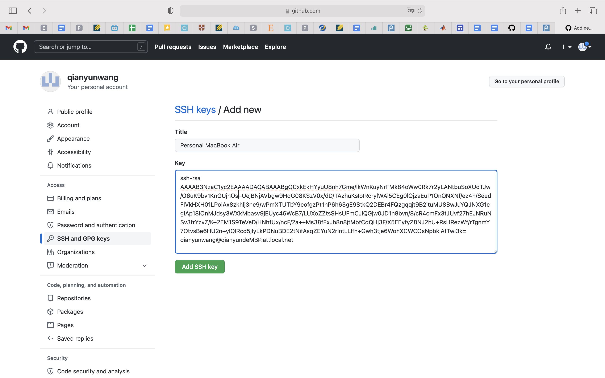

# Lab report 3
* Streamlining ssh Configuration
>   
First, I got into the .ssh directory by entering `cd ~/.ssh` in the terminal. Then, by entering `nano config`, I used the nano editor to create the config file and add the given entries.  
  
After exiting the nano editor, I successfully logged in with `ssh ieng6`.  
  
I used `scp` command using the alias to copy the file index.html onto my account.  

* Setting up Github Access from ieng6
>   
By entering `pbcopy < ~/.ssh/id_rsa.pub`, I copied the public key in the clipboard. Followin the tutorial, I added a new ssh key on my Github.

* Copy whole directories with `scp -r`
