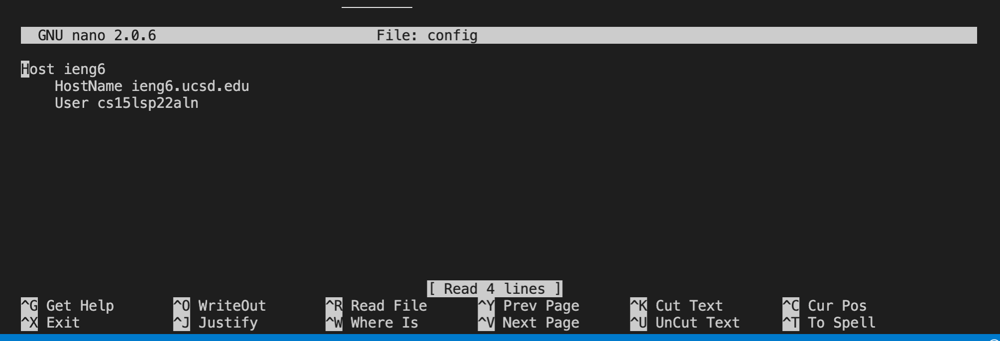
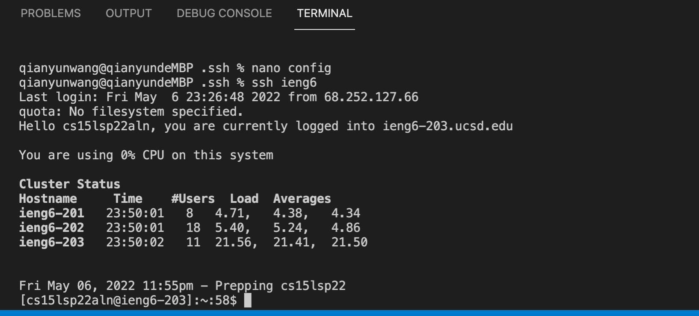
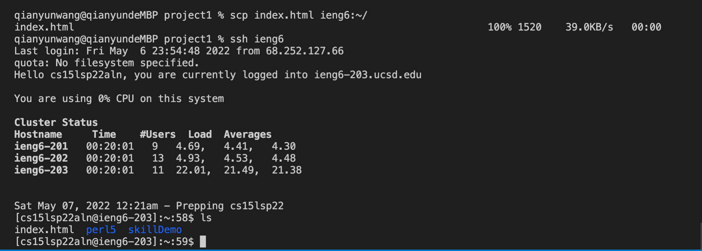
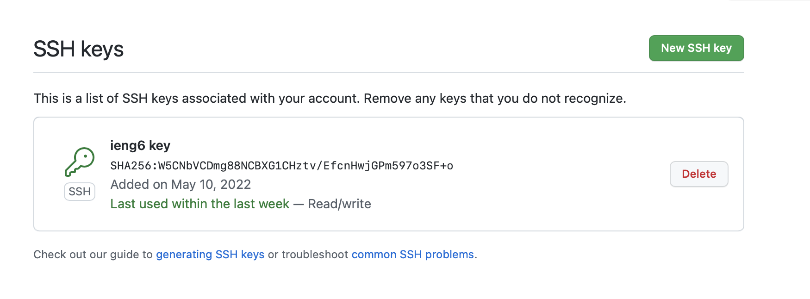
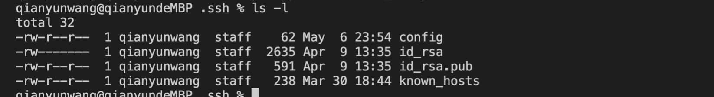
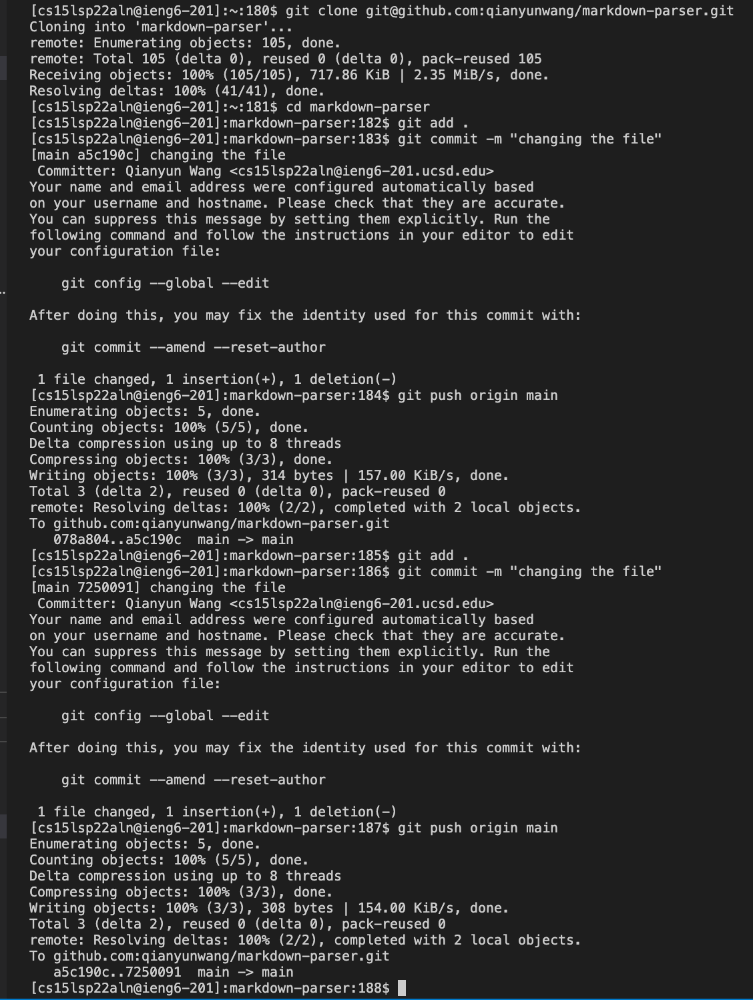
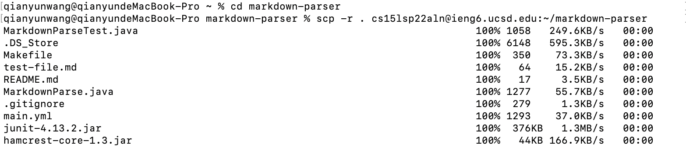
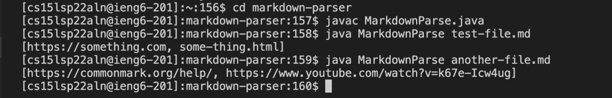
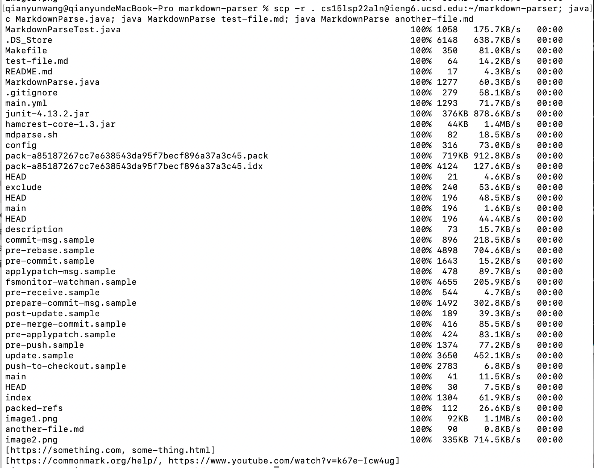

# Lab report 3
* Streamlining ssh Configuration
>   
First, I got into the .ssh directory by entering `cd ~/.ssh` in the terminal. Then, by entering `nano config`, I used the nano editor to create the config file and add the given entries.  
  
After exiting the nano editor, I successfully logged in with `ssh ieng6`.  
  
I used `scp` command using the alias to copy the file index.html onto my account.  

* Setting up Github Access from ieng6
>   
By entering `pbcopy < ~/.ssh/id_rsa.pub`, I copied the public key in the clipboard. Following the tutorial, I added a new ssh key on my Github.  
  
The private and public keys are stored in .ssh directory. The private key is stored in the file id_rsa, while the public one is stored in the file id_rsa.pub.  
  
Now, I cloned my markdown-parser directory on github onto my ieng6 account. After making some change in the file, I commited the change to github from my ieng6 account, which is shown in this [link](https://github.com/qianyunwang/markdown-parser/commit/a5c190c7c3947a2842288bd6c1338e3d3753402c).

* Copy whole directories with `scp -r`
  
I copied the markdown-parser directory onto my ieng6 account.  
  
I compiled the MarkdownParse.java file and ran it on two test files.  
  
Here, I used semicolons to run multiple commands on the same line—copied markdown-parser onto my ieng6 account and ran the two test files.  

