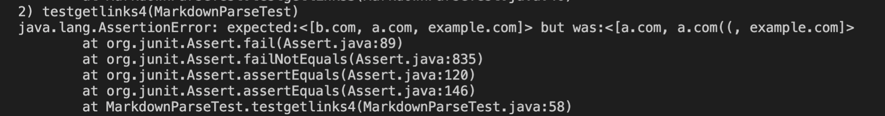
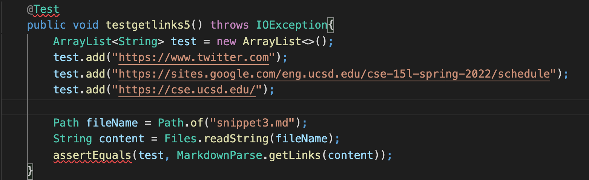

# Lab report 4

[My markdown-parser repository](https://github.com/qianyunwang/markdown-parser)  
[The markdown-parser repository I reviewed in week 7](https://github.com/hpdinh/markdown-parser)  
  
* Snippet 1
> The output should be `[url.com, google.com, ucsd.edu]`.
  
For my implementation, the test did not pass.  

For the implementation I reviewed in Week 7, the test did not pass as well.  

* Snippet 2
> The output should be `[b.com, a.com, example.com]`.  
  
For my implementation, the test did not pass.  
  
For the implementation I reviewed in Week 7, the test did not pass as well.  
  

* Snippet 3
> The output should be `[https://www.twitter.com, https://sites.google.com/eng.ucsd.edu/cse-15l-spring-2022/schedule, https://cse.ucsd.edu/]`.  
  
For my implementation, the test did not pass.  
  
For the implementation I reviewed in Week 7, the test did not pass as well.  
  

* A small (<10 lines) code change is able to make my program work for snippet 1 and all related cases that use inline code with backticks. I will simply check if the elements in `toReturn` includes the backticks. If the elements includes the backticks, I will eliminate the backticks in the elements. 

* A small (<10 lines) code change is able to make my program work for snippet 2 and all related cases that nest parentheses, brackets, and escaped brackets. When I check for brackets and parenthesis, I need to make sure if the brackets are complete and if there's any link inside the parenthesis.

* A small (<10 lines) code change will make my program work for snippet 3 and all related cases that have newlines in brackets and parentheses. The blank lines will result in an out of memory error. So I need to take into account reading in the blank lines in my code.