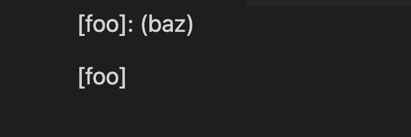

# Lab report 5

* How you found the tests with different results
> I found the two tests with different results by adding `echo $file` in script.sh under `do`. Then running `time bash script.sh` will return the outputs with the corresponding file name. I also copied the script.sh file into local repository. Then comparing the results from both files. I could see that the different results happen in 341.md and 201.md. 
* link to the test-file with different-results
> [341.md](341.md) [201.md](201.md)
* 201.md
> The output from my code is an out of heap error and the output from the other repository is `[baz]`. But the correct output should be `[]` since the file does not contain a link.         
* 341.md
> The output from my code is an index out of bound error and the output from the other repository is `[]`. The other repository gives the correct result since the file does not contain a link, so there should not be anything in the bracket.  

* the bug in the code
> For the heap space and index out of bound error when testing both files using my implementation, I failed to account for the open space between the lines and symbols other than brackets and parenthesis, which led to those errors.

For the implementation in other repository, the code does not check if the output is a link or not. If it is not a link, it should not be included in the final output. Therefore, the implementation should have a check before returning.

